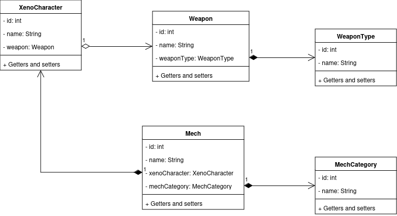

<div align="justify">

# Xeno Wiki


## Índice
- [Planteamiento](#index01)
- [Herramientas utilizadas](#index02)
- [Diagrama de clases básico](#index03)
- [Ejecutar servidor](#index04)

### Planteamiento <a name="index01"></a>

Esta tarea contendrá una wiki muy básica con personajes de Xenogears y Xenosaga, utilizando spring-boot y swagger-ui.

### Herramientas utilizadas <a name="index02"></a>

#### IDEs

- IntelliJ IDEA (código java)
- Visual Studio Code (markdown)

#### Frameworks

- Spring Boot

#### Base de datos

- SQLite

#### ORM

- Hibernate (JPA)

### Diagrama de clases básico <a name="index03"></a>



### Ejecutar servidor <a name="index04"></a>

Para ejecutar el servidor, entrar a la carpeta xenogears-saga-wiki y ejecutar en terminal:

```terminal
mvn clean install
mvn spring-boot:run
```

El servidor se ejecutará en http://localhost:8080

Para ver la documentación de la API con todos los request y endpoints, entrar a http://localhost:8080/api-xeno/swagger-ui.html

</div>